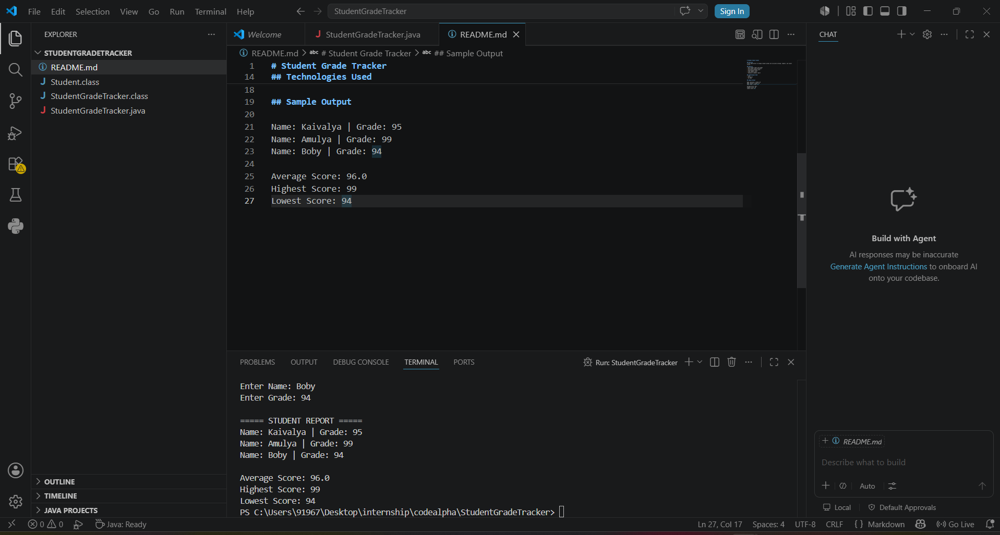

# Student Grade Tracker

## Overview
A Java application to manage student grades and calculate average, highest, and lowest scores.

## Features
- Add student names and grades
- Store data using ArrayList
- Calculate average score
- Find highest score
- Find lowest score
- Display a summary report

## Technologies Used
- Java
- ArrayList
- VS Code

## Sample Output

Name: Kaivalya | Grade: 95
Name: Amulya | Grade: 99
Name: Boby | Grade: 94

Average Score: 96.0
Highest Score: 99
Lowest Score: 94
## Output Screenshot

